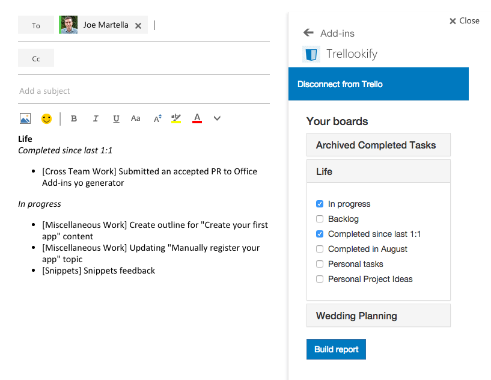

# Trellookify	

Trellookify is an Office Add-in that allows you to convert your Trello boards into a neat report that gets injected into an email. Inspired by a weekly ritual that I do (did!) of manually making lists of Trello lists to update my manager during our weekly 1 on 1's. You can find this application in the Office Store shortly.

## Usage

When you log in to Trello through the Add-in, you'll get a list of all your boards. From there, simply choose which lists you'd like to include in your report. For example, I have a board that has both work and personal todos on and a board for my wedding planning. Though he's a good guy, I don't think my manager cares much about my wedding planning or personal projects (like Trellookify), so I choose to make my "In progress" and "Completed since last 1:1" lists into a report.

## Feedback

For any issues, comments, or general feedback, simply add an issue to the [Issues section](https://github.com/martellaj/Trellookify/issues) of this repository or contact me on [Twitter](http://www.twitter.com/martellaj).